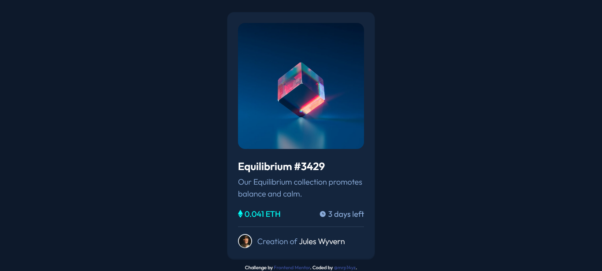

# Frontend Mentor - NFT preview card component solution

This is a solution to the [NFT preview card component challenge on Frontend Mentor](https://www.frontendmentor.io/challenges/nft-preview-card-component-SbdUL_w0U). Frontend Mentor challenges help you improve your coding skills by building realistic projects. 

## Table of contents

- [Overview](#overview)
  - [The challenge](#the-challenge)
  - [Screenshot](#screenshot)
  - [Links](#links)
- [My process](#my-process)
  - [Built with](#built-with)
  - [What I learned](#what-i-learned)
  - [Continued development](#continued-development)
  - [Useful resources](#useful-resources)
- [Author](#author)

**Note: Delete this note and update the table of contents based on what sections you keep.**

## Overview

### The challenge

Users should be able to:

- View the optimal layout depending on their device's screen size
- See hover states for interactive elements

### Screenshot



### Links

- Solution URL: [Solution URL here](https://github.com/mrp14yz/nftpreviewcardchallange)
- Live Site URL: [Live site URL here](https://your-live-site-url.com)

## My process

### Built with

- Semantic HTML5 markup
- CSS custom properties
- [Bootstrap](https://getbootstrap.com/) - CSS Framework

### What I learned

```html
<a href="#">
  <div class="card-img overlay rounded-4">
    
  </div>
</a>
```
```css
.overlay{
  position: absolute;
  top: 0;
  left: 0;
  right: 0;
  bottom: 8px;
  opacity: 0;
  background-color: var(--cyan);
}
```

### Continued development

For next project i would like to try to use @media in css, because i still don't understand how to use it right now.


### Useful resources

- [Overlay Image](https://www.w3schools.com/howto/howto_css_image_overlay.asp) - This helped me when i try to hover for image.

## Author

- Frontend Mentor - [@mrp14yz](https://www.frontendmentor.io/profile/mrp14yz)
